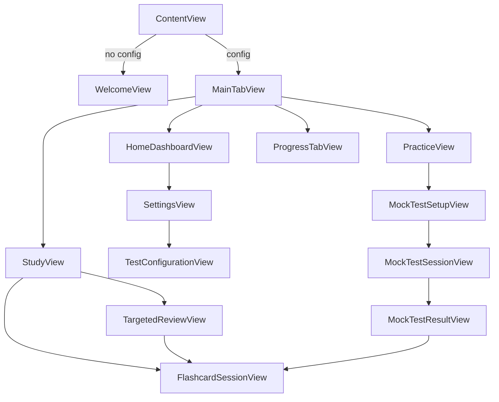

# App Overview

SwiftyCitizen is a SwiftUI + SwiftData app. The root decides between onboarding and the tab shell, and every study flow follows the same shape: load a question deck, drive a pure state machine, persist a session and its attempts.

## Entry point

`SwiftyCitizenApp.swift` creates a shared `ModelContainer` (schema: `Item`, `SavedOnboardingConfiguration`, `StudySession`, `QuestionAttempt`) and injects it via `.modelContainer(sharedModelContainer)`.

`ContentView` decides the root:

- First launch (no persisted configuration): `NavigationStack { WelcomeView() }`.
- Configured: `MainTabView(configuration:)`.

## Tab root

`MainTabView` holds a `TabView` with four tabs defined in `AppTab`:

| Tab | Title | System image | Root view |
| --- | --- | --- | --- |
| home | Home | house | `HomeDashboardView` |
| study | Study | book | `StudyView` |
| practice | Practice | mic | `PracticeView` |
| progress | Progress | chart.bar | `ProgressTabView` (placeholder empty state) |

`HomeDashboardView` receives a `@Binding selectedTab` so its cards (`Start review`, due-next) can switch the user to the Study tab programmatically.

## Navigation map

`SettingsView` edits the persisted configuration in place via `TestConfigurationView` and can delete all saved state (`Reset local progress`). `WelcomeView` and `TestConfigurationView` are the only non-tab flows.

## Layer boundaries

| Layer | Files | Rules |
| --- | --- | --- |
| Screens | `*View.swift` | Read resolution logic from pure types, never contain scoring/selection logic |
| App shell | `SwiftyCitizenApp`, `ContentView`, `MainTabView` | Wire entry points; no business rules |
| Persisted state | `@Model` types | Store learner state only; reference content by stable IDs |
| Pure domain | `AnswerEvaluator`, `FlashcardState`, `ReviewDeckBuilder`, `StudyProgressMetrics`, `ExamEngine`, `MockTestState`, `OnboardingConfiguration`, `TestConfiguration`, `QuestionContent`, `StudyDomain` | No SwiftUI, no SwiftData |
| Content source | `QuestionBankLoader` + bundled JSON | Authoritative official content, validated at load |

## A study flow, generally

1. The entry screen loads `[QuestionContent]` from `QuestionBankLoader` (or builds one for the scope).
2. A pure state machine (`FlashcardState` / `MockTestState`) is created in the view's `init` from the deck.
3. The view drives the state machine with user actions (reveal, assess, submit).
4. On each answer the view appends a `QuestionAttempt` to the session's `StudySession` and saves via `modelContext`.
5. When complete, the view calls `finishSession()` which sets `endedAt` and dismisses.

The configuration (`OnboardingConfiguration`) arrives at every screen via plain value pass-down from the tab root; it is never re-read from the store per screen.

## Related

- `docs/architecture/data-and-persistence.md` → model lifecycle.
- `docs/architecture/dependencies.md` → file-level dependency map.