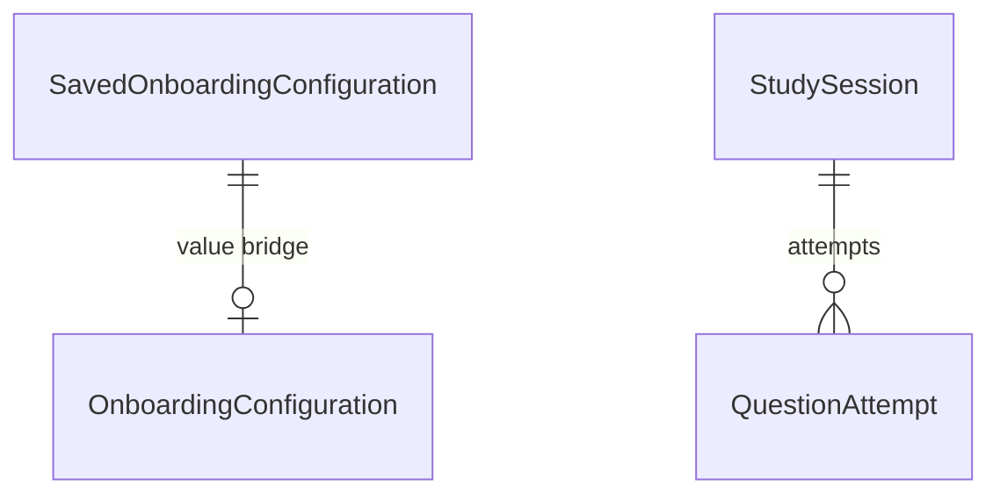

# Data and Persistence

SwiftData stores learner state only. Official content lives in bundled JSON and is referenced by stable IDs. This document covers the schema, the model types, the session/attempt lifecycle, and migration policy.

## Schema

Defined in `SwiftyCitizenApp.swift`:

| Model | Role |
| --- | --- |
| `SavedOnboardingConfiguration` | The single persisted learner configuration (one row); value bridge to `OnboardingConfiguration` |
| `StudySession` | One study flow run; mode, version, started/ended, deck order, position |
| `QuestionAttempt` | One answered question inside a session |
| `Item` | Template leftover (Xcode scaffold); unused by app logic |

## Models

### SavedOnboardingConfiguration

- Raw-value strings for enums; `configuration` property decodes to a value type.
- `init` and `update(from:)` use `precondition(configuration.isValid)` — invalid configs cannot persist.
- `ContentView` reads `savedConfigurations.first` to pick Welcome vs MainTab.

### StudySession

| Property | Type | Notes |
| --- | --- | --- |
| `modeRawValue` / `testVersionRawValue` | String | Enum raw values |
| `startedAt` / `endedAt?` | Date | `endedAt == nil` → session in progress |
| `attempts` | [QuestionAttempt] | Unordered relationship; never assume order |
| `deckStableIDsRaw` | String? | JSON-encoded `[String]` of question IDs, for resume |
| `currentIndex` | Int | Defaulted to `0` |

- `mode`/`testVersion` decode to enums; nil-safe.
- `resumeState(deckQuestions:)` rebuilds a `FlashcardState` from stored deck + attempts.

### QuestionAttempt

| Property | Type | Notes |
| --- | --- | --- |
| `questionStableID` | String | References bank content |
| `testVersionRawValue` | String | Version scope for metrics |
| `assessmentRawValue` | String | `""` for mock-test results → decodes nil |
| `answerText` / `wasCorrect` | String? / Bool? | Set only for mock-test correctness |
| `answeredAt` | Date | Drives "Today" buckets and latest-assessment picks |
| `session` | StudySession? | Inverse relationship |

## Session lifecycle

1. View creates `StudySession(mode:testVersion:)`, inserts into `modelContext`.
2. Each answer appends a `QuestionAttempt` and saves.
3. On completion, `endedAt = .now` and save (keeps `currentIndex`).
4. Exiting before any answer deletes the session.
5. Resume reads the stored session and rebuilds state.

## Metrics

`StudyProgressMetrics` (pure, SwiftData-free) consumes `QuestionAttempt.snapshot`:

- `reviewedToday` — answered today.
- `coverage` — distinct question IDs per version.
- `dueCount` — bank count minus covered.
- `gotItRate` — *self-assessed* attempts only; mock-test attempts (nil assessment) excluded.

## Migration policy

- New attributes on `@Model` types must be **optional or defaulted** so existing on-disk stores migrate in place.
- Storing a new enabled non-defaulted predicate like `currentIndex` previously (= default 0) is the required pattern; a mandatory non-defaulted attribute on an existing store fails with `NSCocoaErrorDomain (134110)`.
- Enum columns stay raw strings; unknown raw values decode to nil rather than crashing.

## Checklist

- [ ] Learner state is the only thing in SwiftData; content stays in bundled JSON.
- [ ] Every new model attribute is optional or defaulted.
- [ ] Attempt order is never relied on; metrics/resume use ID or date lookups.
- [ ] Invalid configurations cannot be persisted.