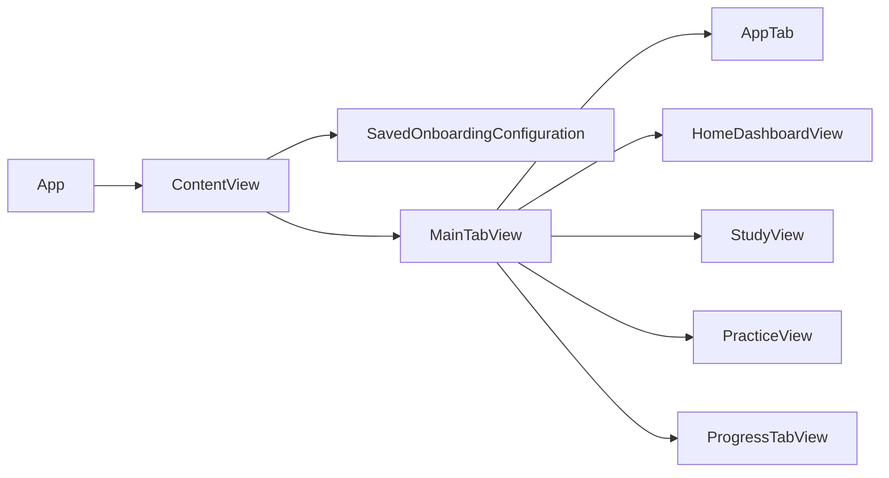
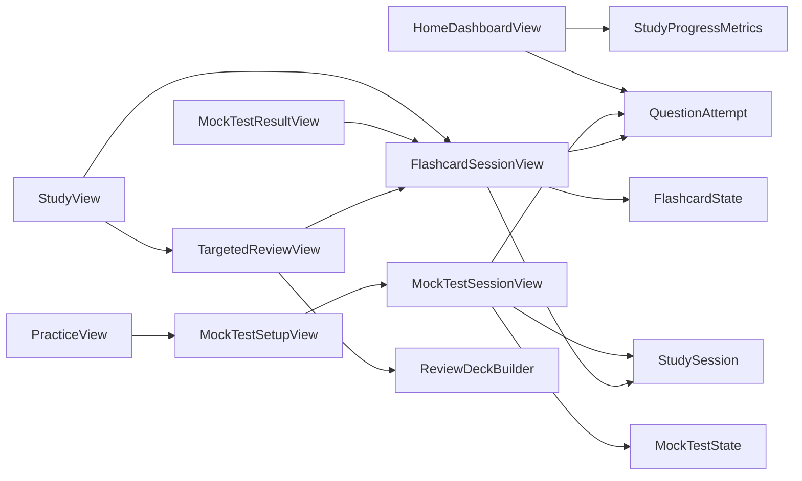
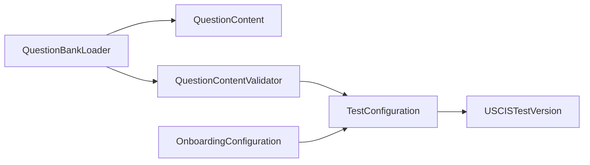
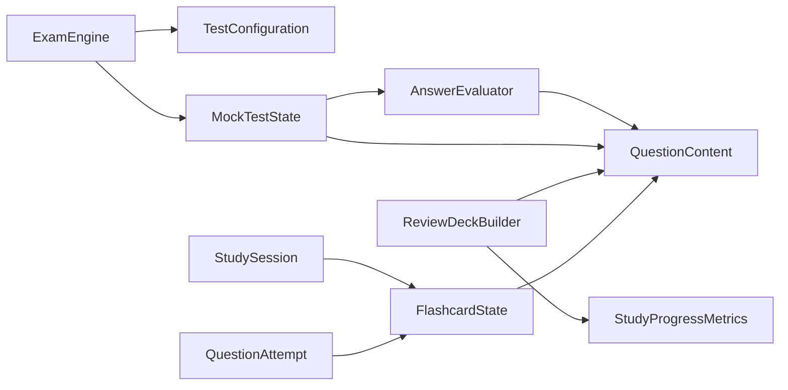

# Dependencies

File-level dependency map and the layer rules that keep behavior testable. The fastest way to see "who talks to whom" and to spot architecture regressions.

## Layer rules

1. **Pure files import only Foundation** (`AnswerEvaluator`, `FlashcardState`, `ReviewDeckBuilder`, `StudyProgressMetrics`, `ExamEngine`, `MockTestState`, `OnboardingConfiguration`, `TestConfiguration`, `QuestionContent`, `StudyDomain`). They can be unit-tested without SwiftUI/SwiftData.
2. **`@Model` files** (`SavedOnboardingConfiguration`, `StudySession`, `QuestionAttempt`) may read pure types for value bridging and resume logic, but never write business rules.
3. **Views** drive the pure state machines; they hold no scoring/selection logic.
4. **One-directional flow**: content → pure domain → persistence → views. Never let a pure type import a view or a `@Model`.

## File-level map

Arrows mean "depends on / references".

### App shell

`SwiftyCitizenApp` owns a `ThemeManager` (`@Observable`, persisted under `appThemeName` in UserDefaults), injects it via `.environment(themeManager)`, and derives the global `.tint` from `themeManager.palette.primary`. Every view reads the palette through `@Environment(ThemeManager.self)`, so changing the theme in Settings re-renders the whole tree immediately. Screens paint `palette.canvas.ignoresSafeArea()` as their background so `surface` cards stay visually elevated in both light and dark mode.

### Views → domain/persistence

### Content pipeline → domain

### Pure domain internal

## Full dependency table

| File | Imports / uses | Depends on |
| --- | --- | --- |
| `AnswerEvaluator.swift` | Foundation | `QuestionContent`, `AnswerCardinality` |
| `AppTab.swift` | SwiftUI | — |
| `AppTheme.swift` | SwiftUI, Observation | `SelfAssessment` (assessment tint), `ThemeManager` (`@Observable`), `AppThemeName`, `AppPalette` |
| `Components.swift` | SwiftUI | `OnboardingConfiguration`, `TestConfiguration` (summary), `AppPalette` |
| `ContentView.swift` | SwiftUI, SwiftData | `MainTabView`, `SavedOnboardingConfiguration`, `TestConfigurationView` |
| `ExamEngine.swift` | Foundation | `TestConfiguration`, `MockTestState`, `QuestionContent` |
| `FlashcardSessionView.swift` | SwiftUI, SwiftData | `FlashcardState`, `StudySession`, `QuestionAttempt`, `QuestionBankLoader`, `SessionSummaryView` |
| `FlashcardState.swift` | Foundation | `QuestionContent`, `SelfAssessment` |
| `HomeDashboardView.swift` | SwiftUI, SwiftData | `StudyProgressMetrics`, `QuestionAttempt`, `ConfigurationSummaryView`, `AppTab` |
| `Item.swift` | SwiftData | — (template scaffold) |
| `MainTabView.swift` | SwiftUI | `AppTab`, `HomeDashboardView`, `StudyView`, `PracticeView`, `ProgressTabView` |
| `MockTestResultView.swift` | SwiftUI | `MockTestState`, `FlashcardSessionView`, `OnboardingConfiguration` |
| `MockTestSessionView.swift` | SwiftUI, SwiftData | `MockTestState`, `ExamEngine`, `QuestionBankLoader`, `StudySession`, `QuestionAttempt` |
| `MockTestSetupView.swift` | SwiftUI | `ConfigurationSummaryView`, `MockTestSessionView`, `QuestionBankLoader` |
| `MockTestState.swift` | Foundation | `QuestionContent`, `AnswerEvaluator` |
| `OnboardingConfiguration.swift` | Foundation | `TestConfiguration`, `StudyLanguage` |
| `OnboardingConfigurationStore.swift` | Foundation, SwiftData | `OnboardingConfiguration` |
| `PracticeView.swift` | SwiftUI, SwiftData | `MockTestSetupView`, `StudyEntryPointView` |
| `ProgressTabView.swift` | SwiftUI | `EmptyStateView` |
| `QuestionBankLoader.swift` | Foundation | `QuestionContent`, `QuestionContentValidator`, `TestConfiguration` |
| `QuestionContent.swift` | Foundation | `TestConfiguration` (via validator) |
| `ReviewDeckBuilder.swift` | Foundation | `QuestionContent`, `StudyAttemptSnapshot`, `SelfAssessment` |
| `SessionSummaryView.swift` | SwiftUI | `SelfAssessment`, `AppPalette` |
| `SettingsView.swift` | SwiftUI, SwiftData | `OnboardingConfiguration`, `SavedOnboardingConfiguration`, `TestConfigurationView`, `AppThemeName` |
| `StudyDomain.swift` | Foundation | — |
| `StudyProgressMetrics.swift` | Foundation | `QuestionAttempt`, `TestConfiguration`, `SelfAssessment` |
| `StudySession.swift` | Foundation, SwiftData | `StudyMode`, `SelfAssessment`, `FlashcardState`, `FlashcardAttemptRecord` |
| `StudyView.swift` | SwiftUI | `FlashcardSessionView`, `TargetedReviewView`, `QuestionBankLoader` |
| `SwiftyCitizenApp.swift` | SwiftUI, SwiftData | `ContentView`, `Item`, `SavedOnboardingConfiguration`, `StudySession`, `QuestionAttempt`, `AppThemeName`, `AppPalette` |
| `TargetedReviewView.swift` | SwiftUI, SwiftData | `ReviewDeckBuilder`, `StudySession`, `FlashcardSessionView` |
| `TestConfiguration.swift` | Foundation | — |
| `TestConfigurationView.swift` | SwiftUI, SwiftData | `OnboardingConfiguration`, `SavedOnboardingConfiguration` |

## Anti-patterns to avoid

- A pure type importing SwiftUI or SwiftData (breaks unit tests).
- `FlashcardSessionView` accumulating exam-scoring logic (belongs to `ExamEngine`/`MockTestState`).
- Views reading raw `deckStableIDsRaw` instead of `StudySession.deckStableIDs`.
- Screens constructing `TestConfiguration` literals; use `TestConfiguration.all` / `OnboardingConfiguration.testConfiguration`.

## Checklist

- [ ] New domain logic lands in a pure file with `import Foundation` only.
- [ ] New screens push every decision into a pure state machine.
- [ ] The dependency table above is updated when a new file or arrow appears.
- [ ] No numeric constants (bank size, passing score) are hardcoded in a view.