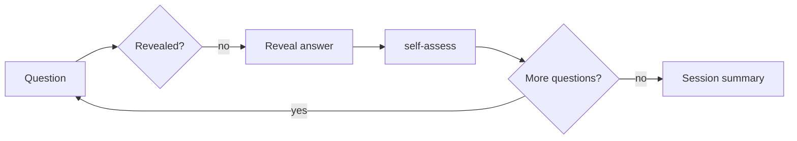
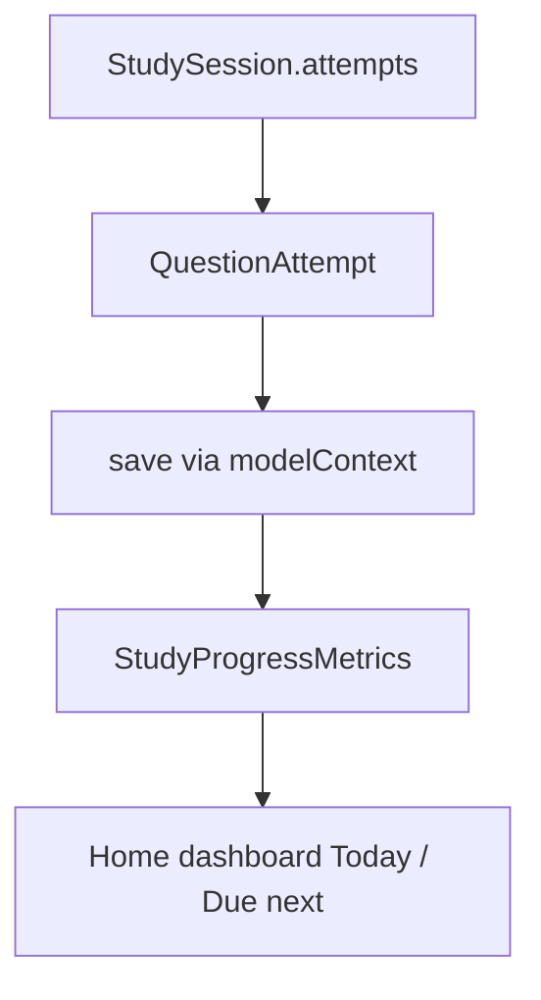

# Flow: Flashcards

The flashcard flow is the base study loop: one official question at a time, the learner writes their own answer, reveal the official answer, compare side by side, self-assess, advance. It is also the rendering host for targeted-review decks and for missed questions from the mock-test result.

## Quick path

1. Study tab → Flashcards (or Targeted review, or a missed-questions link).
2. Question shows + `Your answer` input; the learner types a reply.
3. `Reveal answer` → official answers appear next to the learner's own answer (side by side, no automated verdict).
4. Self-assess:
   - `Again` → re-presents the same question for a fresh attempt (does not advance, records no attempt).
   - `Hard` / `Got it` → marks the card and advances.
5. Last question → `SessionSummaryView` → done.

## Details

| Topic | Decision |
| --- | --- |
| Entry points | `FlashcardSessionView` is pushed from `StudyView` (mode `.flashcards`), from `TargetedReviewView` (mode `.targetedReview`, custom deck, optional resume), and from `MockTestResultView` (missed question deck) |
| State machine | `FlashcardState` — pure struct: `currentIndex`, `isRevealed`, `currentAnswer`, `attempts` |
| Persistence | `StudySession(mode:)` + `QuestionAttempt(assessment:, answerText:)` per answer |
| Version source | `configuration.selectedTestVersion` → `QuestionBankLoader` |

## State machine

`FlashcardState` drives the whole session and is testable without UI.

- `reveal()` sets `isRevealed`; no auto-advance.
- `recordAnswer(_:)` stores the learner's typed reply (trimmed; blank becomes nil) in `currentAnswer`. The view calls it on `Reveal`, before `reveal()`.
- `assess(_ assessment:)` branches on the choice: `.again` re-presents (resets `isRevealed`/`currentAnswer`, advances nothing, records no attempt); `.hard`/`.gotIt` record the attempt with the captured `answerText`, advance `currentIndex`, and reset `isRevealed`/`currentAnswer`. The final confirmation is what marks the card.
- `seek(to:)` and `restore(attempts:)` support resuming an interrupted session; `seek` clears any in-progress answer.
- Questions are selected with order preserved from the bank unless `shuffleQuestions` is enabled in settings, in which case they are shuffled via `selectQuestions(from:maximum:shuffleEnabled:)`.

### Resume

`resumeFlashcardState(deckStableIDs:currentIndex:attempts:deckQuestions:)` rebuilds a `FlashcardState` from the persisted deck order (`session.deckStableIDs`) and answered attempts (`session.attempts.compactMap { $0.flashcardAttemptRecord }`), then seeks to the saved `session.currentIndex`. The reconstruction is pure; the `@Model` only exposes its persisted deck, index, and attempts. `FlashcardSessionView` starts from a resumed state when a resume session is passed in; otherwise it builds a fresh state and creates a new `StudySession`.

## Data flow

## Gotchas

- The relationship `StudySession.attempts` is an unordered to-many; resume and metrics never assume attempt order (tests use dictionary/set lookups, not indices).
- Self-assessment is learner-reported and never presented as a passing score; "Got it" rate is labeled as a rate, not accuracy.
- `Again` re-presents without recording an attempt, so repeated retries do not pollute `gotItRate` and a card that was never confirmed stays `Due` (see `ReviewDeckBuilder`) until the learner confirms `Hard`/`Got it`.
- `QuestionAttempt` uses a `rawValue` string for `SelfAssessment`; unknown values decode to nil and are skipped by metrics.
- Exiting without answers deletes the session; exiting after answers marks it ended (`endedAt`).
- When rendering a missed-questions deck (`.targetedReview` from `MockTestResultView`), the official answer is shown and the learner's own answer is compared against it via `AnswerEvaluator.presentation(for:against:)`, which color-codes the verdict (green correct, amber partial, red wrong) and shows wrong answers side-by-side with the official answer (see `flow-targeted-review.md`).
- In a live flashcard session the learner writes their answer before reveal; `AnswerCard(grading:false)` shows "Your answer" and the "Official answer" side by side with no verdict color, preserving the self-assessment-only principle (no automated grading in flashcards). The view picks the source per question: a seeded `userAnswers` entry (missed-question review) wins, otherwise `state.currentAnswer`.

## Checklist

- [ ] Flashcard deck loads from the selected version's bank.
- [ ] Reveal does not auto-advance.
- [ ] Each assessment persists one `QuestionAttempt` on the session.
- [x] The learner can type their own answer before reveal; it is captured in `FlashcardState.currentAnswer`, stored in `QuestionAttempt.answerText`, and shown side by side with the official answer (no verdict).
- [x] `Again` re-presents the same question for a fresh attempt without advancing or recording; only `Hard`/`Got it` mark the card and advance.
- [ ] Interrupted sessions resume to the saved position.
- [ ] Summary shows per-assessment counts.
- [ ] Dashboard Today/Due figures change after assessment.
- [x] Missed-question review renders the learner's own wrong answer next to the official answer, color-coded by verdict.