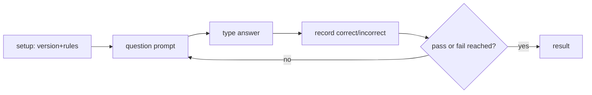
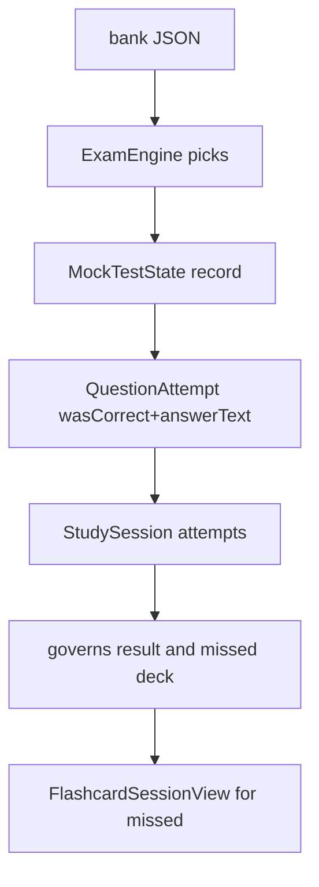

# Flow: Mock Test

Oral-style simulation of the civics test using the selected version's official rules: fixed bank size, max questions, and passing score, with early pass/fail. Answer is typed and evaluated deterministically (speech is Phase 4).

## Quick path

1. Practice tab → Mock test → setup shows version, bank, max questions, passing score.
2. Start → questions one at a time; type an answer and record it.
3. Early pass (score reached) or early fail (unreachable) or last question → result.
4. Result shows score + disclaimer; missed questions link to targeted review.

## Details

| Topic | Decision |
| --- | --- |
| Rules source | `TestConfiguration.all` matched by `configuration.selectedTestVersion` (see `uscis-test-rules.md`) |
| Question selection | `ExamEngine.selectQuestions(from:maximum:shuffle:)` — draws the configured maximum from the bank |
| State machine | `MockTestState` — pure struct: question order, answers, pass/fail/active phase |
| Answer evaluation | `AnswerEvaluator` token-set matcher; cardinality 1 vs 2 distinct rules |
| Answer format | Typed free-text only today; single-select and multi-select are planned (see `content-pipeline.md`) |
| Persistence | `StudySession(mode: .mockTest)` + `QuestionAttempt(wasCorrect, answerText)` |

## State machine

`MockTestState` owns the whole exam simulation and is testable without UI.

- Pass: `correctCount >= passingScore` (early stop).
- Fail: `correctCount + (maximumQuestionsAsked - answered) < passingScore` (unreachable, early stop).
- Otherwise run until `currentIndex >= maximumQuestionsAsked`.

### Randomization

`ExamEngine.makeState(from:configuration:shuffle:)` uses `Array(shuffle(bank).prefix(maximum))`. `shuffle` is injectable so tests are deterministic; production passes the default `shuffled()`.

## Answer evaluation

`AnswerEvaluator.evaluate(_:against:)`:

- Tokenizes the typed answer into a lowercase `Set<String>` (drops `( ) , ;`).
- Cardinality 1: correct if the answer tokens are a subset of an official variant's tokens (lenient on extra/missing filler, strict on keywords).
- Cardinality 2: requires at least two *distinct* variants' tokens to each be a subset of the answer tokens.
- Evaluates deterministically; no AI, no semantic matching.

## Per-answer feedback (session review)

`MockTestSessionView` records each answer with `state.record()` **without** advancing, then shows its verdict inline and waits for a "Next" tap — uniform manual advance for **all** verdicts.

- **All verdicts** (correct-exact, rejected, lenient-accepted): show their inline indicator ("Correct" / "Incorrect" / "Accepted: ...") and wait for a "Next" tap to advance.
- **Feedback off** (`sessionFeedbackManager.isEnabled == false`): records, saves the attempt, and advances immediately with no indicator.

The verdict is rendered by `SessionFeedbackIndicator` (inline on the question card) using palette tints: green `success` for "Correct", red `danger` for "Incorrect", amber `warning` for "Accepted". The feedback indicator sits **below** the question card so VoiceOver announces it after the question content. The "Record answer" button is disabled while a review is pending (`review != nil`) so a verdict can't be replaced before the learner taps "Next".

The `sessionFeedbackEnabled` flag lives in `SessionFeedbackManager` (`@Observable`, persisted under `sessionFeedbackEnabled` in UserDefaults) injected via `.environment`, mirroring `ThemeManager`. When off, the deck advances normally and no indicator renders.

## Data flow

### Session review state

`MockTestSessionView` holds `review: MockTestAnswer?`, which drives both the inline indicator and the "Next" button. Because advance is uniform, every verdict shows "Next" once recorded; when passing score is reached mid-session, `state.isComplete` becomes true and the "Next" button relabels to "See results".

## Gotchas

- Mock-test attempts set `assessmentRawValue` to empty (`""`); `QuestionAttempt.assessment` decodes nil, so mock results never pollute the self-assessment "Got it" rate.
- The result view's `NavigationLink` reuses `FlashcardSessionView` in `.targetedReview` mode with the missed deck.
- Only correct/incorrect counts persist; the typed string is kept in `answerText` for later re-review.
- The missed-questions review currently passes only the `QuestionContent` deck, so the learner's own wrong answer is not shown next to the official one. Surfacing `answerText` (or the chosen options) alongside the official answer in the review is a planned enhancement.
- Answer mode is Manual only; `MockTestSetupView` hard-codes the mode row until Phase 4 speech.
- Advance is uniform: every verdict waits for a "Next" tap (feedback on) or advances immediately (feedback off). There is no 0.8s auto-advance and no stored `Task`, so the view can dismiss safely between answers without racing a stale advance.

## Checklist

- [ ] Setup shows active version, bank size, max questions, passing score.
- [ ] Question count respects the selected version's maximum.
- [ ] Early pass/fail terminates before asking every question when allowed.
- [ ] Typed answers are evaluated against official variants deterministically.
- [ ] Result shows score, pass/fail, and the study-aid disclaimer.
- [ ] Missed questions open targeted review over that deck.
- [ ] Targeted review of missed questions shows the learner's own answer next to the official one.
- [ ] Mock-test results do not change the dashboard "Got it" rate.
- [ ] Per-answer feedback indicator shows for all verdicts inline on the question card; every verdict waits for a "Next" tap (uniform manual advance).
- [ ] `sessionFeedbackEnabled` flag toggles all indicators off at runtime.