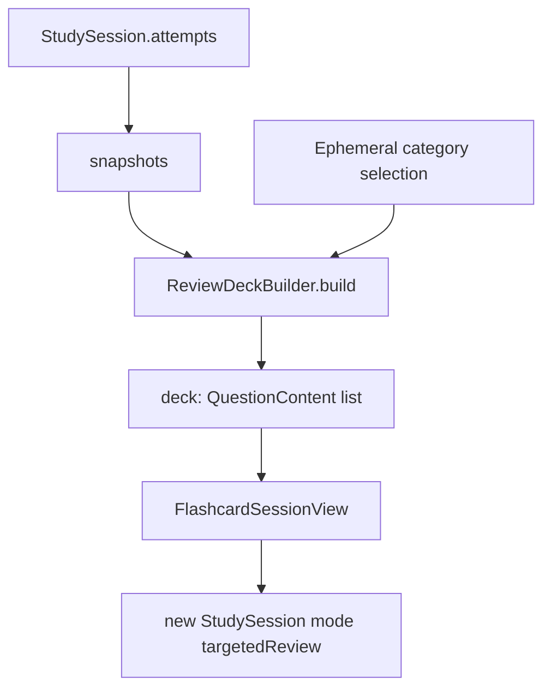

# Flow: Targeted Review

Review the questions that need attention, computed from persisted attempt history, using the same flashcard rendering host. Supports resuming an interrupted session.

## Quick path

1. Study tab → Targeted review.
2. Pick a scope: Due, Unanswered, or Needs work.
3. (Optional) Toggle "Show categories" and select one or more topic pills to further narrow the deck.
4. Start review over the filtered deck (bank order preserved).
5. If a session is in progress, the list offers `Resume session`.

## Details

| Topic | Decision |
| --- | --- |
| Deck logic | `ReviewDeckBuilder` — pure, SwiftData-free; does not depend on `StudySession`/UI |
| Scopes | `.due` (unanswered, or latest ≠ Got it), `.unanswered` (no attempt), `.needsWork` (answered, latest ≠ Got it) |
| Category filter | Optional; layered on top of the scope in `ReviewDeckBuilder`. Enabled by the "Show categories" toggle; selected topics (`Set<String>`) narrow the scope-filtered deck by `QuestionContent.topic`; empty selection applies no filter. Selection is ephemeral (`@State`), multi-select. |
| Rendering | Reuses `FlashcardSessionView` with `mode: .targetedReview` |
| Resume | `StudySession(mode: .targetedReview)` with persisted `deckStableIDs` + `currentIndex`; list shows `Resume session` only while `!isComplete && answeredCount > 0` |

## Scope definitions

| Scope | Question is included when |
| --- | --- |
| Due | No attempt yet, *or* latest self-assessment is not Got it |
| Unanswered | No recorded attempt |
| Needs work | Has an attempt, and latest self-assessment is not Got it |

`latestAssessmentByQuestion` groups attempts by question ID and picks the max by `answeredAt`; questions with no assessment (e.g. mock-test attempts) fall back to `.again`.

## Category filter

`ReviewDeckBuilder.build`/`questionCount` take an optional `categories: Set<String>` applied *after* scope filtering, preserving bank order. `categorySummary(questions:attempts:scope:)` returns the sorted topics present in the scope-filtered deck plus per-topic counts; the view renders them as pills labeled `"\(topic) (\(count))"`. The filter lives in the pure Foundation-only builder so it is unit-tested like the scopes; `TargetedReviewView` only manages the ephemeral mode toggle and the selection set. When "Show categories" is off, the view passes an empty set so behavior is identical to before.

## Data flow

## Gotchas

- Deck order is the bank's order, not "most-recent" or random.
- A session is "in progress" for the resume row when it has answers but no `endedAt`.
- Scope counts and the start button both derive from `ReviewDeckBuilder`, so they never disagree.
- Mock-test missed-questions reuse this flow's deck rendering (`.targetedReview` mode) from `MockTestResultView`.
- Missed-question review shows the learner's own (wrong) answer next to the official answer. `FlashcardSessionView` passes the recorded answer as `userAnswer`; `AnswerCard` compares it with `AnswerEvaluator.presentation(for:against:)`, which color-codes the verdict and renders wrong answers side-by-side with the official answer. The review host pairs each question with its recorded answer instead of showing a bare `QuestionContent` deck.

## Checklist

- [ ] Each scope's count matches the deck that starts.
- [x] Category filter narrows the scope-filtered deck by `topic`; empty selection applies no filter; scope counts and pills reflect both filters.
- [ ] Resuming restores deck order and position.
- [ ] A completed session no longer shows a resume row.
- [ ] Targeted-review attempts persist with assessment, not `wasCorrect`.
- [x] Missed-question review pairs each question with the learner's own (color-coded) answer and the official answer, shown side-by-side when wrong.