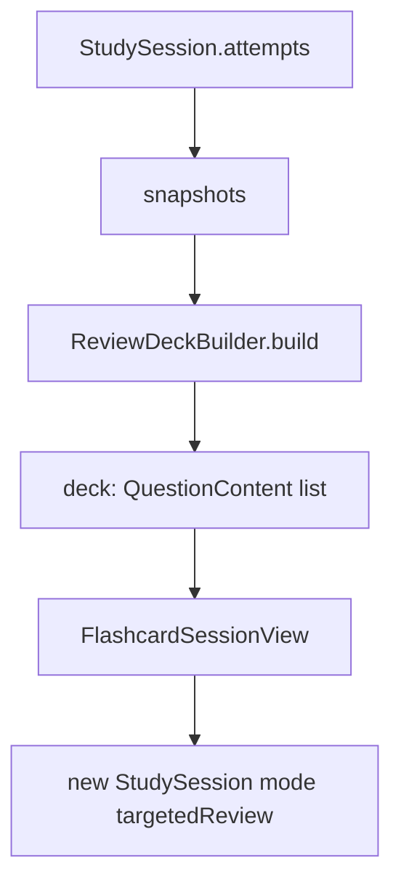

# Flow: Targeted Review

Review the questions that need attention, computed from persisted attempt history, using the same flashcard rendering host. Supports resuming an interrupted session.

## Quick path

1. Study tab → Targeted review.
2. Pick a scope: Due, Unanswered, or Needs work.
3. Start review over the filtered deck (bank order preserved).
4. If a session is in progress, the list offers `Resume session`.

## Details

| Topic | Decision |
| --- | --- |
| Deck logic | `ReviewDeckBuilder` — pure, SwiftData-free; does not depend on `StudySession`/UI |
| Scopes | `.due` (unanswered, or latest ≠ Got it), `.unanswered` (no attempt), `.needsWork` (answered, latest ≠ Got it) |
| Rendering | Reuses `FlashcardSessionView` with `mode: .targetedReview` |
| Resume | `StudySession(mode: .targetedReview)` with persisted `deckStableIDs` + `currentIndex`; list shows `Resume session` only while `!isComplete && answeredCount > 0` |

## Scope definitions

| Scope | Question is included when |
| --- | --- |
| Due | No attempt yet, *or* latest self-assessment is not Got it |
| Unanswered | No recorded attempt |
| Needs work | Has an attempt, and latest self-assessment is not Got it |

`latestAssessmentByQuestion` groups attempts by question ID and picks the max by `answeredAt`; questions with no assessment (e.g. mock-test attempts) fall back to `.again`.

## Data flow

## Gotchas

- Deck order is the bank's order, not "most-recent" or random.
- A session is "in progress" for the resume row when it has answers but no `endedAt`.
- Scope counts and the start button both derive from `ReviewDeckBuilder`, so they never disagree.
- Mock-test missed-questions reuse this flow's deck rendering (`.targetedReview` mode) from `MockTestResultView`.
- Missed-question review should show the learner's own (wrong) answer next to the official answer. When the deck comes from a mock test, the persisted `QuestionAttempt.answerText` carries it; the review host must pair the attempt with its question instead of starting from the bare `QuestionContent` deck.

## Checklist

- [ ] Each scope's count matches the deck that starts.
- [ ] Resuming restores deck order and position.
- [ ] A completed session no longer shows a resume row.
- [ ] Targeted-review attempts persist with assessment, not `wasCorrect`.
- [ ] Missed-question review pairs each question with the learner's own answer and the official answer.