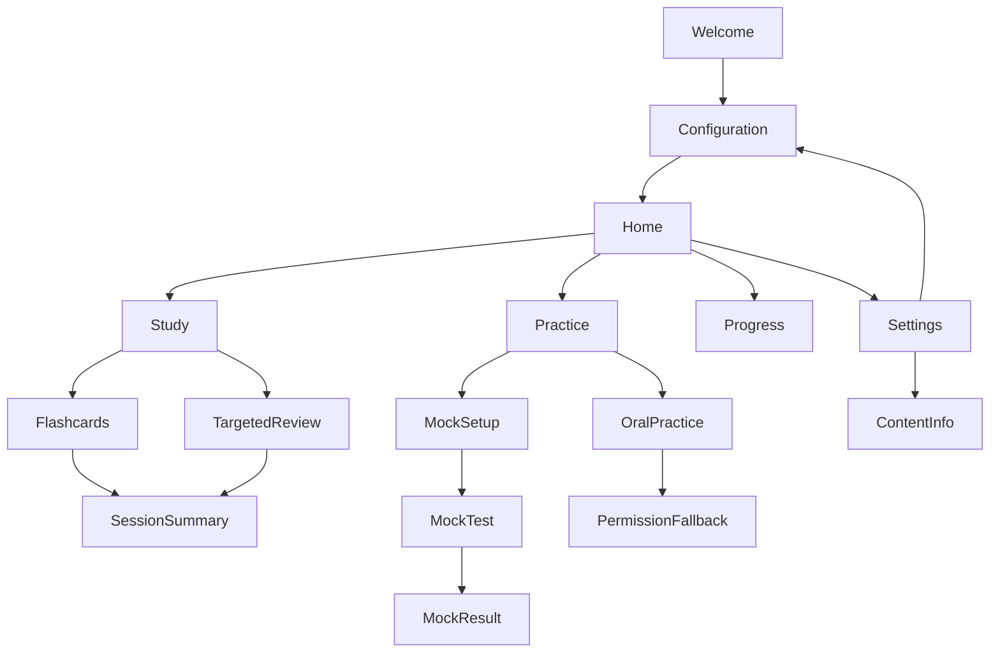
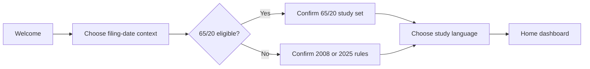
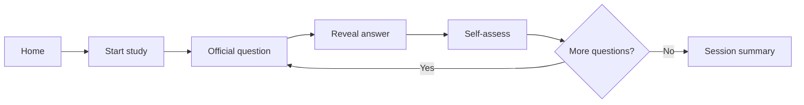
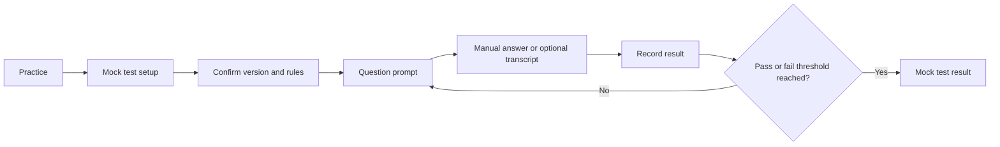
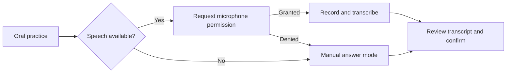

# Phase 0.5 Design Specification

Status: Low-fidelity flow alignment is complete; accessibility review of the implemented screens is in progress, with high-fidelity polish and export backup still pending

This document is the repository-backed design source for Phase 0.5. It defines the first-release navigation, high-risk user flows, low-fidelity wireframes, visual direction, and interaction states before production UI implementation begins.

## Current Design Status

The current repository state includes the low-fidelity onboarding, flashcard, mock-test, and speech-fallback flows. The design work is sufficient to start the next implementation slice, but it is still intentionally incomplete as a final design handoff because typography, accessibility, and the final export backup still need a formal review.

The implemented screens were audited against the Accessibility Baseline below. The following concrete gaps were fixed in code: Dynamic Type support for `SessionSummaryView` and `WelcomeView` (now scrollable so text does not clip at large sizes), a 44-point touch target for the close control in `SessionProgressHeader`, a non-color selection indicator (checkmark) for review scopes, and explicit "Content unavailable" states in `StudyView` and `MockTestSetupView` when a question bank cannot load. Remaining accessibility work is the formal Dynamic Type and VoiceOver review on a small iPhone viewport and the high-fidelity pass.

## Design Principles

- Put the next useful study action first.
- Keep the current USCIS test configuration visible at decision points.
- Prefer calm, focused study surfaces over dashboard decoration.
- Treat official content as authoritative and generated aids as secondary.
- Make every core study action usable without a microphone or network connection.
- Use progressive disclosure: show the essential answer first, then supporting metadata.

## Navigation



The primary navigation is Home, Study, Practice, Progress, and Settings. Welcome and Test Configuration are onboarding or modal flows, not permanent tabs.

## High-Risk Flows

### Flow A: First Run and Test Configuration

Goal: configure the correct study rules without presenting legal advice.



Required behaviors:

- Explain that the app is a study aid and does not determine legal eligibility.
- Show the resulting test version, question count, and passing score before confirmation.
- Allow the learner to edit the configuration later from Settings.
- Do not silently switch banks when the filing-date context changes.

### Flow B: Flashcard Study

Goal: learn one official question at a time with a low-friction loop.



Required behaviors:

- The question side shows the official wording and question number.
- The answer side shows official answers and answer cardinality.
- Self-assessment uses explicit labels such as Again, Hard, and Got it.
- Source or current-answer warnings are available without interrupting the study loop.
- A learner can exit and resume without losing the current session state.

### Flow C: Mock Test

Goal: simulate the oral civics test using the active official rules.



Required behaviors:

- The setup screen shows version, bank size, maximum questions, and passing score.
- The official simulation remains usable without speech recognition.
- Pause and exit are available without accidentally recording an answer.
- The result distinguishes app scoring from an actual USCIS decision.
- Missed questions link directly to targeted review.

### Flow D: Speech Permission and Fallback

Goal: make oral practice additive rather than a dependency.



Required behaviors:

- Explain why microphone access is requested before the system prompt.
- Never block flashcards or manual mock tests when permission is denied.
- Show partial, empty, interrupted, and unavailable-transcription states.
- Let the learner confirm or correct the recognized result.

## Low-Fidelity Screen Notes

### Home Dashboard

```text
+--------------------------------+
| SwiftyCitizen          Settings|
| 2025 test | 20 questions | 12  |
|                                |
| Continue studying              |
| [  Start review             ]  |
|                                |
| Today                          |
| 12 reviewed     75% correct   |
|                                |
| Due next                       |
| 8 questions                   >|
|                                |
| Home  Study  Practice Progress|
+--------------------------------+
```

### Flashcard Study

```text
+--------------------------------+
| Close                 3 of 20  |
|                                |
| Question 12                    |
| What is the supreme law        |
| of the land?                   |
|                                |
|          [ Reveal answer ]     |
|                                |
| Home  Study  Practice Progress|
+--------------------------------+
```

After reveal, the primary action becomes the self-assessment control row. The official answer remains the visual focal point; source and dynamic-answer metadata sit below it.

### Mock Test Setup

```text
+--------------------------------+
| Mock test                      |
|                                |
| 2025 Civics Test               |
| Up to 20 questions             |
| Need 12 correct                |
|                                |
| Answer mode                    |
| ( ) Manual   ( ) Speech aid   |
|                                |
| [ Start mock test ]            |
+--------------------------------+
```

### Permission Fallback

```text
+--------------------------------+
| Speech practice                |
|                                |
| Microphone access is off.      |
| You can still practice by      |
| typing or answering aloud      |
| without automatic transcription.|
|                                |
| [ Use manual practice ]        |
| [ Open Settings ]              |
+--------------------------------+
```

## Visual Direction

The visual direction is civic, calm, and study-oriented rather than governmental or gamified.

| Token | Direction |
| --- | --- |
| Typography | A readable humanist sans-serif with strong number and question hierarchy |
| Primary color | Deep ink or navy for structure and trust |
| Accent color | Warm amber for active study actions and progress highlights |
| Success color | Accessible green paired with text, never color alone |
| Error color | Accessible red paired with text and an icon or label |
| Surface | Warm neutral background with high-contrast content surfaces |
| Shape | Restrained corner radius and consistent touch targets |
| Motion | Short, purposeful reveal and progress transitions; respect Reduce Motion |

Do not use color alone to communicate correctness, eligibility, or pass/fail status.

## Component Inventory

- `AppTabBar`
- `ConfigurationSummary`
- `PrimaryActionButton`
- `QuestionCard`
- `AnswerCard`
- `SelfAssessmentControl`
- `ProgressMeter`
- `SourceBadge`
- `CurrentAnswerNotice`
- `PermissionFallbackPanel`
- `SessionProgressHeader`
- `EmptyState`
- `ErrorState`

Each component needs default, pressed, disabled, loading, and accessibility states where applicable.

## Accessibility Baseline

- Support Dynamic Type without clipping question or answer text.
- Provide VoiceOver labels that include question number, state, and primary action.
- Keep touch targets at least 44 by 44 points.
- Pair color with text, icon, or shape for all status communication.
- Avoid auto-advancing after a learner reveals or answers a card.
- Respect Reduce Motion and provide a non-animated card transition.
- Keep the manual path available when microphone, speech assets, or network services are unavailable.
- Announce session progress without interrupting the answer content.

### Audit status against the implementation

Reviewed the shipped screens against the baseline on the current simulator target (iOS 27, iPhone 17e frame). Verified already-correct: VoiceOver labels for question number and primary actions, no auto-advance after reveal or answer, no motion-dependent transitions (inherent Reduce Motion support), and manual-answer paths never blocked. Fixed during this review: Dynamic Type clipping in `WelcomeView` and `SessionSummaryView` (now scrollable), the sub-44-point close control in `SessionProgressHeader`, color-only scope selection in `TargetedReviewView` (added a checkmark), and silent empty sessions when a bank fails to load (now explicit `Content unavailable` states). Remaining: a formal Dynamic Type / VoiceOver pass on a small viewport (e.g., the 420x900 frame) and the high-fidelity prototypes.

## Prototype Checklist

- [x] Recreate the navigation flow in Penpot.
- [x] Create low-fidelity wireframes for Welcome, Configuration, Home, Flashcard, Mock Setup, Mock Test, Result, and Permission Fallback.
- [ ] Create high-fidelity prototypes for Flows A-D.
- [ ] Review configuration visibility and oral-practice fallback on a small phone viewport.
- [ ] Export or back up the design files locally.
- [ ] Record accepted design decisions and unresolved questions in this document.

Penpot contains an initial generic pass (`WF - ...`) and a second pass built with the integrated `Wireframing kit v1.1` library. The kit-based boards are named `WF2 - Welcome`, `WF2 - Test Configuration`, `WF2 - Home Dashboard`, `WF2 - Flashcard Study`, `WF2 - Mock Test Setup`, `WF2 - Mock Test`, `WF2 - Mock Test Result`, and `WF2 - Permission Fallback`. They use a 420 by 900 mobile frame as the current review target. The `WF2 - ...` boards are the reference iteration.

The kit-based boards were rebuilt with relative child positioning after insertion. Their direct elements use a minimum 16-point frame margin, explicit text widths, and separated vertical blocks. The dashboard's review button intentionally sits inside its continuation card.

## Open Decisions

- [ ] Final typography choice.
- [ ] Final color tokens and contrast verification.
- [ ] Whether Progress is a tab or a Home destination in the first release.
- [ ] Exact wording for the 65/20 eligibility explanation after product review.
- [ ] Whether audio playback belongs in Phase 1 or Phase 4.
